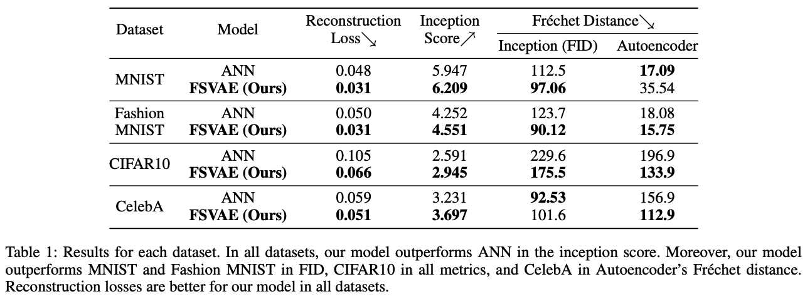
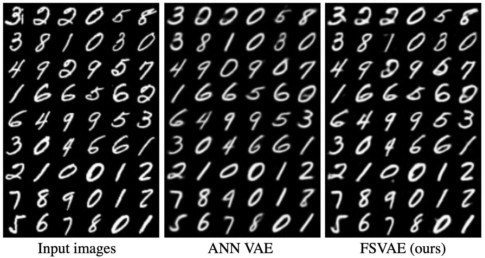
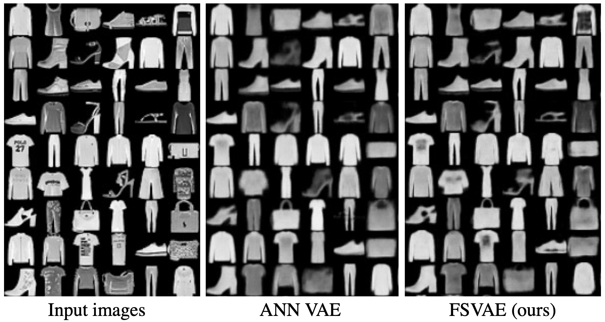
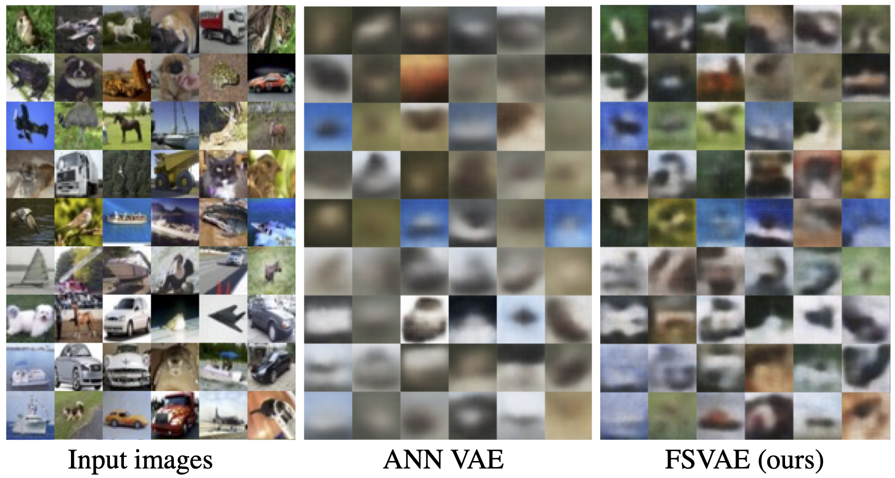
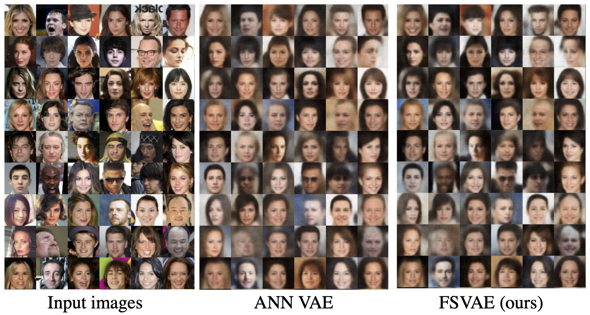
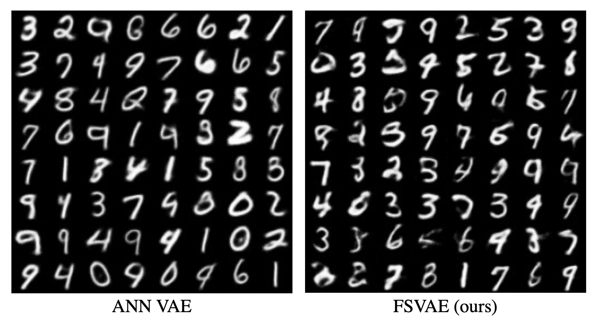
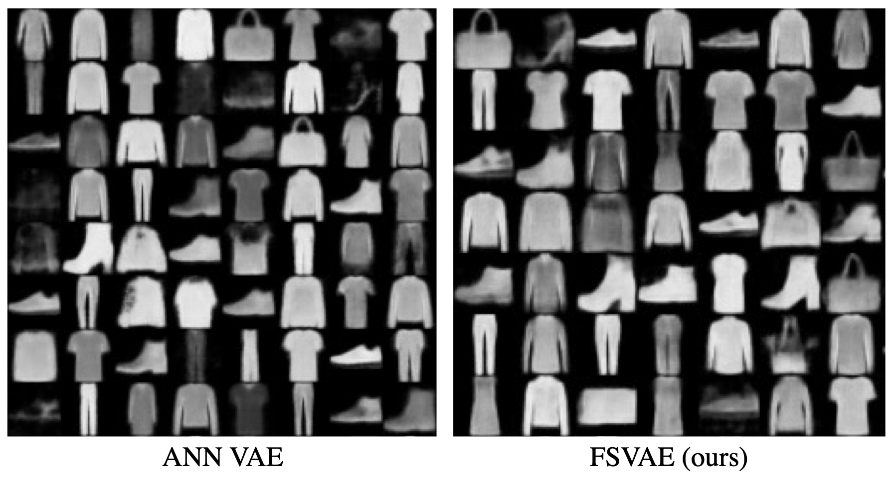
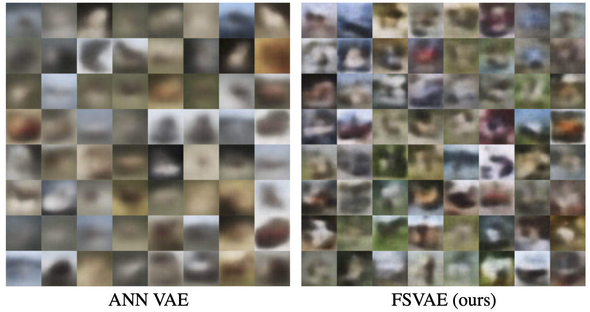
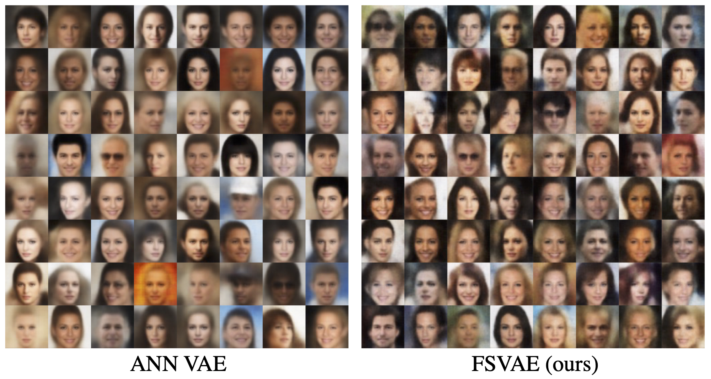

# Fully Spiking Conditional Variational Autoencoder (FSCVAE)
Implementation of the Fully Spiking Conditional Variational Autoencoder.

Accepted to **AAAI2022**!!

paper: https://ojs.aaai.org/index.php/AAAI/article/view/20665/20424

arxiv: https://arxiv.org/abs/2110.00375


# Get started

1. install dependencies

```
pip install -r requirements.txt
```

2. initialize the fid stats

```
python init_fid_stats.py
```

# Demo
The following command calculates the Inception score & FID of FSCVAE trained on CelebA. After that, it outputs `demo_input.png`, `demo_recons.png`, and `demo_sample.png`.
```
python demo.py
```
If CelebA cannot be downloaded, you can still generate samples from the demo checkpoint without loading the dataset:
```
python demo.py --sample-only --skip-metrics
```

# Training FSCVAE
```
python main_fsvae exp_name -config NetworkConfigs/dataset_name.yaml
```

To train FSCVAE on CelebA, using all 40 CelebA attributes as the
condition for the posterior, autoregressive prior, and decoder, run:

```bash
python main_fsvae.py celeba_cvae -config NetworkConfigs/CelebA_CVAE.yaml
```

The FSCVAE condition is not concatenated with every time step. A recurrent LIF
condition encoder produces condition spikes `c_1:T`; time-selective gates then
modulate the encoder current, posterior, conditional prior, and decoder. The
three ablation configurations are:

- `CelebA_CVAE_Latent.yaml`: static projected condition, no proposed losses.
- `CelebA_CVAE_Temporal.yaml`: LIF temporal encoding and gates, no proposed losses.
- `CelebA_CVAE.yaml`: temporal model plus consistency/alignment losses.

`NetworkConfigs/CelebA.yaml` remains the original unconditional baseline. The
conditional model adds encoder/gate/loss-head parameters, so an unconditional
checkpoint cannot be loaded into it with strict state-dict loading.

Training settings are defined in `NetworkConfigs/*.yaml`.

args:
- name: [required] experiment name
- config: [required] config file path
- checkpoint: checkpoint path (if use pretrained model) 
- device: device id of gpu, default 0

You can watch the logs with below command and access http://localhost:8009/ 

```
tensorboard --logdir checkpoint --bind_all --port 8009
```

# Training ANN VAE
As a comparison method, we prepared vanilla VAEs of the same network architecture built with ANN, and trained on the same settings.

```
python main_ann_vae exp_name -dataset dataset_name
```

args: 
- name: [required] experiment name
- dataset:[required] dataset name [mnist, fashion, celeba, cifar10]
- batch_size: default 250
- latent_dim: default 128
- checkpoint: checkpoint path (if use pretrained model) 
- device: device id of gpu, default 0

# Evaluation


# Reconstructed Images





# Generated Images




